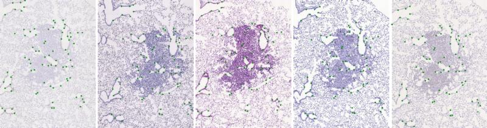
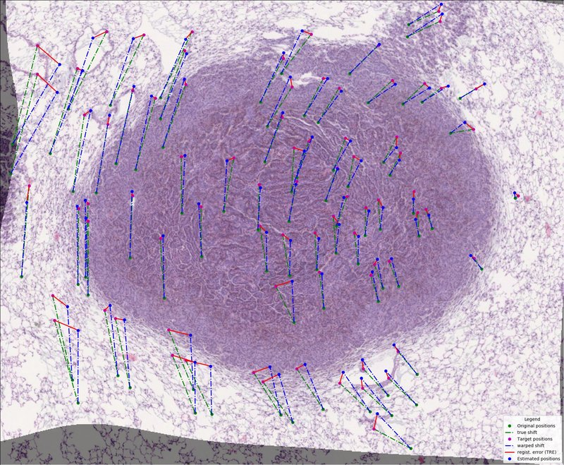
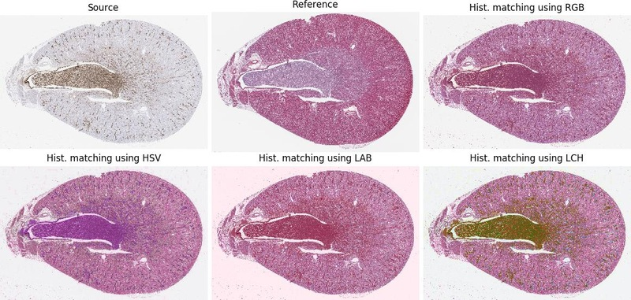

# BIRL: Benchmark on Image Registration methods with Landmark validation

[](https://travis-ci.org/Borda/BIRL)
[](https://circleci.com/gh/Borda/BIRL)
[](https://ci.appveyor.com/project/Borda/birl/branch/master)
[](https://codecov.io/gh/Borda/BIRL)
[](https://www.codacy.com/project/Borda/BIRL/dashboard?utm_source=github.com&amp;utm_medium=referral&amp;utm_content=Borda/BIRL&amp;utm_campaign=Badge_Grade_Dashboard)
[](https://www.codefactor.io/repository/github/borda/birl)
[](https://birl.readthedocs.io/en/latest/?badge=latest)
[](https://gitter.im/BmImRegLnd/community?utm_source=badge&utm_medium=badge&utm_campaign=pr-badge)
<!--
[](https://app.shippable.com/github/Borda/BIRL)
[](https://landscape.io/github/Borda/BIRL/master)
[](https://codebeat.co/projects/github-com-borda-birl-master)
[](https://app.shippable.com/github/Borda/BIRL)
[](https://forum.image.sc/tags/anhir)
-->

---

_This project/framework is the key component of **[Automatic Non-rigid Histological Image Registration (ANHIR)](https://anhir.grand-challenge.org)** challenge hosted at [ISBI 2019](https://biomedicalimaging.org/2019/challenges/) conference. The related discussion is hosted on [forum.image.sc](https://forum.image.sc/tags/anhir)._

---

The project contains a set of sample images with related landmark annotations and experimental evaluation of state-of-the-art image registration methods.

The initial [dataset of stained histological tissues](http://cmp.felk.cvut.cz/~borovji3/?page=dataset) is composed by image pairs of related sections (mainly, consecutive cuts).
Each image in the pair is coloured with a different stain. 
The registration of those images is a challenging task due to both artefacts and deformations acquired during sample preparation and appearance differences due to staining. 
For evaluation, we have manually placed landmarks in each image pair. There are at least 40 uniformly spread over the tissue. 
We do not put any landmarks in the background.
For more information about annotation creation and landmarks handling, we refer to the special repository - [Dataset: histology landmarks](http://borda.github.com/dataset-histology-landmarks).



The dataset is defined by a CSV file containing paths to target and sensed image and their related landmarks _(see `./data_images/pairs-imgs-lnds_mix.csv`)_. With the change of the cover table, the benchmarks can be used for any other image dataset.


## Features

List of the main/key features of this package:

* **automatic** execution of image registration of a sequence of image pairs
* integrated **evaluation** of registration performances using Target Registration Error (TRE)
* integrated **visualization** of performed registration
* running several image registration experiment in **parallel**
* **resuming** unfinished sequence of registration benchmark
* handling around dataset and **creating own experiments**
* using basic **image pre-processing** - normalizing
* rerun evaluation and visualisation for finished experiments


## Structure

The project contains the following folders:

* `benchmarks` - package with benchmark & template and general useful utils
    * `utilities` - useful tools and functions
* `bm_ANHIR` - scripts related directly to ANHIR challenge
* `bm_dataset` - package handling dataset creation and servicing
* `bm_experiments` - package with particular benchmark experiments
* `configs` - configs for registration methods
* `data_images` - folder with input sample data
    * `images` - sample image pairs (reference and sensed one)
    * `landmarks` - related landmarks to images in previous folder
    * `lesions_` - samples of histology tissue with annotation
    * `rat-kidney_` - samples of histology tissue with annotation
* `docs` - sphinx documentation and references
* `scripts` - scripts and macros (ImageJ/Python/Rscript) for registration and work around
* `tests` - package testing and test requirements


## Installation

This package can be simply install using pip running
```bash
pip install https://github.com/Borda/BIRL/archive/master.zip
```
or via `setuptools` running from a local folder
```bash
python setup.py install
```
For installing some particular version/releases use following links
_https://github.com/Borda/BIRL/archive/v0.2.3.zip_
where the numbers match desired version
(see package [releases](https://github.com/Borda/BIRL/releases)). 

---

## Before benchmarks (pre-processing) 

In the `data_images` folder we provide some sample images with landmarks for registration. 
These sample registration pairs are saved in `data_images/pairs-imgs-lnds_mix.csv`. 
You can create your own costume cover table for a given dataset (folder with images and landmarks) by hand or use script `bm_dataset/create_registration_pairs.py` assuming the same folder structure `<dataset>/<image-set>/<scale>/<images-and-landmarks>` as for the [CIMA dataset](http://cmp.felk.cvut.cz/~borovji3/?page=dataset).

### Prepare synthetic data

There is a script to generate synthetic data. 
Just set an initial image and their corresponding landmarks. 
The script will generate a set of geometrically deformed images mimicking different stains and compute the new related landmarks.

```bash
python bm_dataset/create_real_synth_dataset.py \
    -i ./data_images/images/Rat_Kidney_HE.jpg \
    -l ./data_images/landmarks/Rat_Kidney_HE.csv \
    -o ./output/synth_dataset \
    -nb 5 --nb_workers 3 --visual
```

### Creating an image-pairs table

When the synthetic datasets have been created, the cover csv file which contains the registration pairs (Reference and Moving image (landmarks)) is generated. 
Two modes are created: _"first2all"_ for registering the first image to all others and _"each2all"_ for registering each image to all other. 
_(note A-B is the same as B-A)_

```bash
python bm_dataset/generate_regist_pairs.py \
    -i ./data_images/synth_dataset/*.jpg \
    -l ./data_images/synth_dataset/*.csv \
    -csv ./data_images/cover_synth-dataset.csv \
    --mode each2all
```

### Customize the images and landmarks

We offer a script for scaling images in to particular scales for example
```bash
python bm_dataset/rescale_tissue_images.py \
    -i "./data_images/rat-kidney_/scale-5pc/*.jpg" \
    -scales 10 -ext .png --nb_workers 2
```

We introduce an option how to randomly take only a subset (use `nb_selected`) of annotated landmarks and also add some synthetic point (filling points up to `nb_total`) which are across set aligned using estimate affine transformation.

```bash
python bm_dataset/rescale_tissue_landmarks.py \
    -a ./data_images -d ./output \
    --nb_selected 0.5 --nb_total 200
``` 

Moreover we developed two additional script for converting large images, handling multiple tissue samples in single image and crop to wide background.
 * `bm_dataset/convert_tiff2png.py` converts TIFF or SVS image to PNG in a particular level
 * `bm_dataset/split_images_two_tissues.py` splits two tissue samples with clear wide bound in vertical or horizontal direction
 * `bm_dataset/crop_tissue_images.py` crops the tissue sample removing wide homogeneous background

---

## Experiments with included methods

Even though this framework is completely customizable we include several image registration methods commonly used in medical imaging.



### Install methods and run benchmarks

For each registration method, different experiments can be performed independently using different values of the parameters or image pairs sets. 

Sample execution of the "empty" benchmark template:
```bash
python birl/bm_template.py \
    -t ./data_images/pairs-imgs-lnds_mix.csv \
    -o ./results \
    -cfg sample_config.yaml \
    --preprocessing matching-rgb gray \
    --unique --visual
```
or with relative paths:
```bash
python birl/bm_template.py \
    -t ./data_images/pairs-imgs-lnds_histol.csv \
    -d ./data_images \
    -o ./results \
    -cfg sample_config.yaml \
    --preprocessing gray matching-rgb
```

The general Image Registration benchmarks contain couple required and optional parameters which are shared among 'all' methods/benchmarks. The brief description is following...

**Required** parameters:
* `-t`/`--path_table` path to the cover table describing image/landmarks registration pairs
* `-d`/`--path_dataset` path to the dataset folder with images and landmarks
* `-o`/`--path_out` output path for saving results

**Optional** parameters:
* `--preprocessing` offer some image pre-processing before image registration starts, the order defines order of performed operations; the options are `matching-<color-space>` (where `<color-space>` is for example `rgb` or `hsv`) equalise source to target image and `gray` converting both images to gray-scale
* `--unique` each experiment has creation stamp included in its name (prevent overwriting experiments with the same method)
* `--visual` generate a simple visualisation of particular image registrations



Measure your computer performance using average execution time on several simple image registrations.
The registration consists of loading images, denoising, feature detection, transform estimation and image warping. 
```bash
python bm_experiments/bm_comp_perform.py -o ./results
```
This script generate simple report exported in JSON file on given output path.


### Included registration methods

For each benchmark experiment, the explanation about how to install and use a particular registration method is given in the documentation. Brief text at the top of each file.

* **[bUnwarpJ](http://imagej.net/BUnwarpJ)** is the [ImageJ](https://imagej.nih.gov/ij/) plugin for elastic registration (optional usage of histogram matching and integration with [Feature Extraction](http://imagej.net/Feature_Extraction)).
    ```bash
    python bm_experiments/bm_bUnwarpJ.py \
        -t ./data_images/pairs-imgs-lnds_histol.csv \
        -d ./data_images \
        -o ./results \
        -Fiji ~/Applications/Fiji.app/ImageJ-linux64 \
        -cfg ./configs/ImageJ_bUnwarpJ_histol.yaml \
        --preprocessing matching-rgb \
        --visual --unique
    ```
* **[Register Virtual Stack Slices (RVSS)](https://imagej.net/Register_Virtual_Stack_Slices)** is the [ImageJ](https://imagej.nih.gov/ij/) plugin for affine/elastic registration of a sequence of images.
    ```bash
    python bm_experiments/bm_RVSS.py \
        -t ./data_images/pairs-imgs-lnds_histol.csv \
        -d ./data_images \
        -o ./results \
        -Fiji ~/Applications/Fiji.app/ImageJ-linux64 \
        -cfg ./configs/ImageJ_RVSS_histol.yaml \
        --visual --unique
    ```
* **[elastix](http://elastix.isi.uu.nl/)** is image registration toolkit based on [ITK](http://www.itk.org/) and it consists of a collection of algorithms that are commonly used to solve (medical) image registration problems. For more details see [documentation](http://elastix.isi.uu.nl/download/elastix_manual_v4.8.pdf).
    ```bash
    python bm_experiments/bm_elastix.py \
        -t ./data_images/pairs-imgs-lnds_histol.csv \
        -d ./data_images \
        -o ./results \
        -elastix ~/Applications/elastix/bin \
        -cfg ./configs/elastix_affine.txt \
        --visual --unique
    ```
* **[rNiftyReg](https://github.com/jonclayden/RNiftyReg)** is an R-native interface to the [NiftyReg image registration library](http://sourceforge.net/projects/niftyreg/) which contains programs to perform rigid, affine and non-linear registration of Nifty or analyse images. _NiftyReg supports max image size 2048._
    ```bash
    python bm_experiments/bm_rNiftyReg.py \
        -t ./data_images/pairs-imgs-lnds_histol.csv \
        -d ./data_images \
        -o ./results \
        -R Rscript \
        -script ./scripts/Rscript/RNiftyReg_linear.r \
        --visual --unique
    ```
* **[Advanced Normalization Tools](http://stnava.github.io/ANTs/) (ANTs)** is a medical imaging framework containing state-of-the-art medical image registration and segmentation methods.
    ```bash
    python bm_experiments/bm_ANTs.py \
        -t ./data_images/pairs-imgs-lnds_anhir.csv \
        -d ./data_images \
        -o ./results \
        -ANTs ~/Applications/antsbin/bin \
        -cfg ./configs/ANTs_SyN.txt
    ```
    For illustration see ANTsPy [registration tutorial](https://github.com/ANTsX/ANTsPy/blob/master/tutorials/10minTutorial.ipynb).
    ```bash
    python bm_experiments/bm_ANTsPy.py \
        -t ./data_images/pairs-imgs-lnds_histol.csv \
        -d ./data_images \
        -o ./results \
        -py python3 \
        -script ./scripts/Python/run_ANTsPy.py \
        --visual --unique
    ```
* **[DROP](https://github.com/biomedia-mira/drop2)** is image registration and motion estimation based on Markov Random Fields.
    ```bash
    python bm_experiments/bm_DROP2.py \
        -t ./data_images/pairs-imgs-lnds_histol.csv \
        -d ./data_images \
        -o ./results \
        -DROP ~/Applications/DROP2/dropreg \
        -cfg ./configs/DROP2.txt \
        --visual --unique
    ```
* ...

Some more image registration methods integrated in ImageJ are listed in [Registration](https://imagej.net/Registration).


### Add custom registration method

The only limitation of adding costume image registration methods that it has to be launched from python script or command line. The new registration benchmark should be inherited from [ImRegBenchmark](birl/benchmark.py) as for example [BmTemplate](birl/bm_template.py).

The benchmark workflow is the following:
1. `self._prepare()` prepare the experiment, e.g. create experiment folder, copy configurations, etc.
2. `self._load_data()` the load required data - the experiment cover file
3. `self._run()` perform the sequence of experiments (optionally in parallel) and save experimental results (registration outputs and partial statistic) to common table and optionally do particular visualisation of performed experiments
4. `self._evaluate()` evaluate results of all performed experiments
4. `self._summarise()` summarize and export results from complete benchmark.

General methods that should be overwritten:
 * `_check_required_params(...)` verify that all required input parameters are given _[on the beginning of benchmark]_
 * `_prepare_img_registration(...)` if some extra preparation before running own image registrations are needed _[before each image registration experiment]_
 * `_execute_img_registration` execute/perform the image registration, time of this methods is measured as execution time. In case you call external method from command line, just rewrite `_generate_regist_command(...)` which prepare the registration command to be executed, also you can add generating complete registration script/macro if needed; _[core of each image registration experiment]_
 * `_extract_warped_image_landmarks(...)` extract the required warped landmarks or perform landmark warping in this stage if it was not already part of the image registration _[after each image registration experiment]_
 * `_extract_execution_time(...)` optionally extract the execution time from the external script _[after each image registration experiment]_
 * `_clear_after_registration(...)` removing some temporary files generated during image registration _[after each image registration experiment]_

The new image registration methods should be added to `bm_experiments` folder.


### Re-evaluate experiment

In case you need to re-compute evaluation or add visualisation to existing experiment you can use the following script. 
The script require complete experiment folder with standard `registration-results.scv` (similar to registration pairs extended by experiment results). 

```bash
python bm_experiments/evaluate_experiment.py \
    -e ./results/BmUnwarpJ \
    --visual
``` 

---

## License

The project is using the standard [BSD license](http://opensource.org/licenses/BSD-3-Clause).


## References

For complete references see [bibtex](docs/references.bib).
1. Borovec, J., Munoz-Barrutia, A., & Kybic, J. (2018). **[Benchmarking of image registration methods for differently stained histological slides](https://www.researchgate.net/publication/325019076_Benchmarking_of_image_registration_methods_for_differently_stained_histological_slides)**. In IEEE International Conference on Image Processing (ICIP) (pp. 3368–3372), Athens. [DOI: 10.1109/ICIP.2018.8451040](https://doi.org/10.1109/ICIP.2018.8451040)
2. Borovec, J. (2019). **BIRL: Benchmark on Image Registration methods with Landmark validation**. arXiv preprint [arXiv:1912.13452](https://arxiv.org/abs/1912.13452).

## Appendix - Useful information

**Configure local environment**

Create your own local environment, for more information see the [User Guide](https://pip.pypa.io/en/latest/user_guide.html), and install dependencies requirements.txt contains a list of packages and can be installed as
```bash
@duda:~$ cd BIRL 
@duda:~/BIRL$ virtualenv env
@duda:~/BIRL$ source env/bin/activate  
(env)@duda:~/BIRL$ pip install -r requirements.txt  
(env)@duda:~/BIRL$ python ...
```
and in the end, terminating...
```bash
(env)@duda:~$ deactivate
```

**Running docString tests** - documentation and samples of doc string on [pymotw](https://pymotw.com/2/doctest/) and [python/docs](https://docs.python.org/2/library/doctest.html)

**Listing dataset in command line**  
```bash
find . | sed -e "s/[^-][^\/]*\// |/g" -e "s/|\([^ ]\)/|-\1/" >> dataset.txt
```
